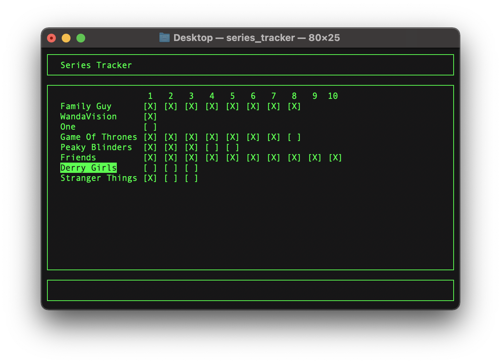

# Series Tracker  [](https://github.com/aidanm3341/series-tracker/actions/workflows/c-cpp.yml)

This project has a make file, so the project can be built with just running ``` make ``` in the directory containing 'makefile'.
You can then install the program by running ``` make install ```

Once installation has completed, you can run the program by typing "series_tracker" in the terminal.

## How to Use
You can add a new series to track by pressing the ```a``` key. This will then prompt you to enter a name (which doesn't already exist in the app), and then the number of series that it has.

You can scroll through the series with the up and down arrows. Once you have your selected series, you can add or remove marks on the checkboxes with the left and right arrows.

If you want to delete a series for whatever reason, select it and press the ```d``` key. This will then prompt you to check if you're sure, where you can then type 'y' or 'n' to confirm or cancel it. 

## Screenshots

